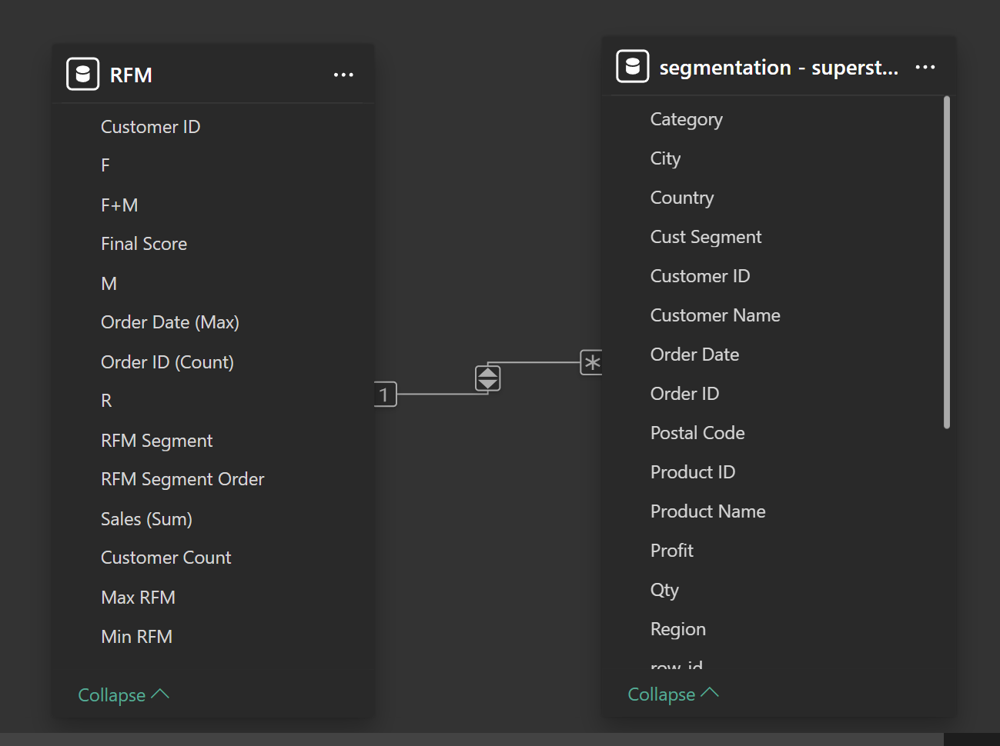

# **Super Store RFM Customer Segmentation Dashboard**

## Project Overview
This project provides a comprehensive analysis of customer behavior using the Recency, Frequency, and Monetary (RFM) model. Leveraging the Superstore dataset (2014–2017), this interactive Power BI dashboard visualizes key insights into customer segmentation, purchasing patterns, and revenue contribution.
The primary goal is to help businesses identify high-value customers, reduce churn, and optimize marketing strategies through data-driven decisions.

### Preview Dashboard [[*Click here to see dashboard*]](https://app.powerbi.com/groups/me/reports/d9cb1296-377c-499b-8471-5bb214c2acc3/b3f159c48e2e69ee3c8e?experience=power-bi)


## Insights and Recommendations Cover the Following Key Areas

1. Overall Customer Distribution & Trends
2. RFM Score Analysis & Segment Performance
3. Revenue Contribution by Segment
4. Geographic and Time-Based Patterns

The dataset was modeled and analyzed using Power Query and DAX in Power BI to create a user-friendly and insightful dashboard.

***Power BI Dashboard Link***

## Dataset & Model
- **Data Source:** Superstore dataset (2014–2017).
- **Data Model:**
  - **RFM Table:** Aggregated metrics per customer (R, F, M, F+M, Final Score, Segment).
  - **Segmentation Table:** Raw transactional data (Order, Customer, Product, Location).
- **Relationship:** `Customer ID` connects RFM to Segmentation in a **One-to-Many** relationship.

### Model View


## RFM Methodology
- **Recency (R):** The number of days since the customer’s last transaction up to the reference date.
- **Frequency (F):** The total number of unique transactions per customer.
- **Monetary (M):** The total sales value per customer.
- **Score:** Assigned on a scale of 1–5 based on quintiles.
- **Final Score:** Combination of R and F+M (average of Frequency and Monetary, rounded).
- **Segmentation:**
  - Champions: R = 5, F+M ∈ {4, 5}  
  - Loyal Customers: R ∈ {3, 4}, F+M ∈ {4, 5}  
  - Can’t Lose Them: R ∈ {1, 2}, F+M = 5  
  - At Risk: R ∈ {1, 2}, F+M ∈ {3, 4}  
  - Hibernating: R ∈ {1, 2}, F+M ∈ {1, 2}  
  - Potential Loyalist: R ∈ {4, 5}, F+M ∈ {2, 3}  
  - About to Sleep: R = 3, F+M = 3  
  - Need Attention: R = 3, F+M ∈ {1, 2}  
  - New Customers: R = 5, F+M = 1  
  - Promising: R = 4, F+M = 1  

## DAX Measures
```dax
// F+M (dibulatkan ke skala 1–5)
F+M =
ROUND( ( 'RFM'[F] + 'RFM'[M] ) / 2, 0 )

// RFM Segment
RFM Segment =
SWITCH (
    TRUE(),
    RFM[R] = 5 && RFM[F+M] IN { 4, 5 }, "Champions",
    RFM[R] IN { 3, 4 } && RFM[F+M] IN { 4, 5 }, "Loyal Customers",
    RFM[R] IN { 1, 2 } && RFM[F+M] = 5, "Can't Lose Them",
    RFM[R] IN { 1, 2 } && RFM[F+M] IN { 3, 4 }, "At Risk",
    RFM[R] IN { 1, 2 } && RFM[F+M] IN { 1, 2 }, "Hibernating",
    RFM[R] IN { 4, 5 } && RFM[F+M] IN { 2, 3 }, "Potential Loyalist",
    RFM[R] = 3 && RFM[F+M] = 3, "About to Sleep",
    RFM[R] = 3 && RFM[F+M] IN { 1, 2 }, "Need Attention",
    RFM[R] = 5 && RFM[F+M] = 1, "New Customers",
    RFM[R] = 4 && RFM[F+M] = 1, "Promising",
    "Unclassified"
)
